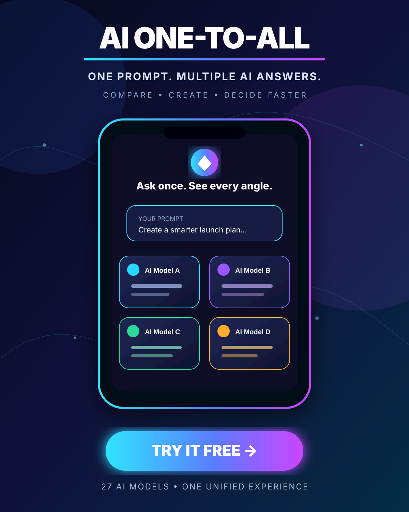

# AI ONE-TO-ALL — Public Launch

## One prompt. Multiple AI answers.

AI ONE-TO-ALL brings 27 AI models into one unified experience for chat, image, and speech workflows. Ask once, compare perspectives, create faster, and install the experience as a PWA.

### [Launch AI ONE-TO-ALL →](https://clever-crafts-pwa.lovable.app/)

## Free campaign copy

**Short post**

> Stop switching between AI tabs. AI ONE-TO-ALL brings 27 AI models into one unified experience—ask once, compare answers, and decide faster. Try it free: https://clever-crafts-pwa.lovable.app/

**Product-launch post**

> 🚀 AI ONE-TO-ALL is live.
>
> One prompt. Multiple AI answers.
>
> Compare different AI perspectives in one clean workspace, explore chat, image, and speech tools, keep local conversation history, and install it as a PWA.
>
> Try it free: https://clever-crafts-pwa.lovable.app/
>
> #AI #Productivity #PWA #ArtificialIntelligence #BuildInPublic

**WhatsApp status**

> AI ONE-TO-ALL is live 🚀 Ask once, compare multiple AI answers, and work faster. Try it free: https://clever-crafts-pwa.lovable.app/

## Zero-cost distribution channels

- GitHub repository and launch page — live
- Product Hunt — prepared; publication requires human verification
- Hacker News Show HN — prepared; publication requires a valid account
- WhatsApp Status, Facebook groups, LinkedIn, Reddit, and X — use the copy above with the campaign artwork

This launch makes no paid-ad commitment and does not claim app-store availability before approval.
